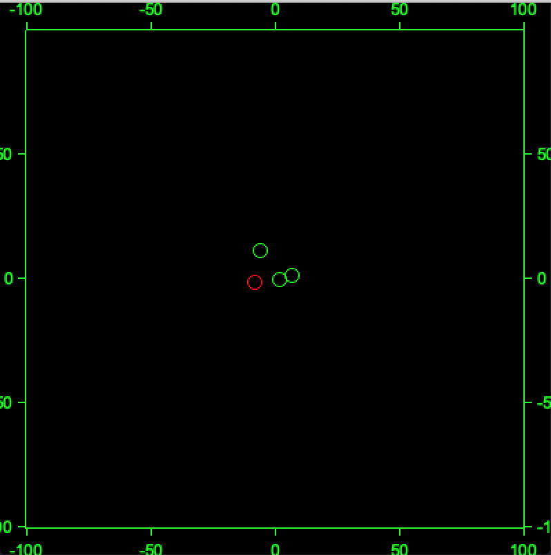
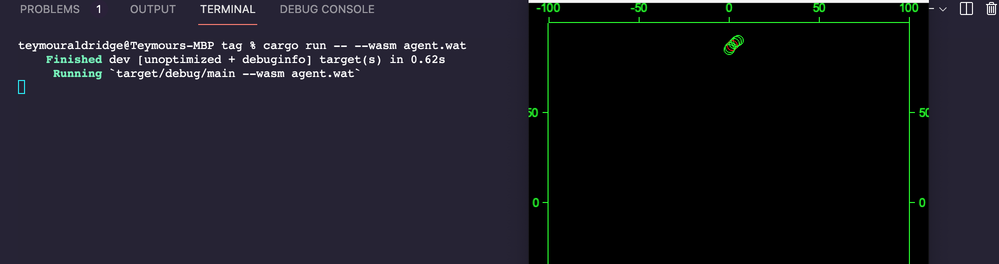

# Tag!

Simulates a game of tag amongst (hopefully) friends!

To run this, type:

```shell
cargo run
```

To run a demonstration Wasm agent, simply run

```shell
cargo run -- --wasm agent.wat
```

This will open up a window and show you how the game of tag is progressing.

## Performance analysis

To produce a flamegraph, run:

```shell
./bench.sh
```

You may need (after reading the script very carefully :D) to use

```shell
sudo ./bench.sh
```

on MacOS, because `dtrace` has problems with permissions otherwise.

This will tell you how much time each function took to execute, at each level of the call stack.

## Screenshots




(Dots in green are not "it", dots in red are "it")

## Tests

To test this library, run

```cargo
cargo test --workspace
```

(the `--workspace` flag is essential)
